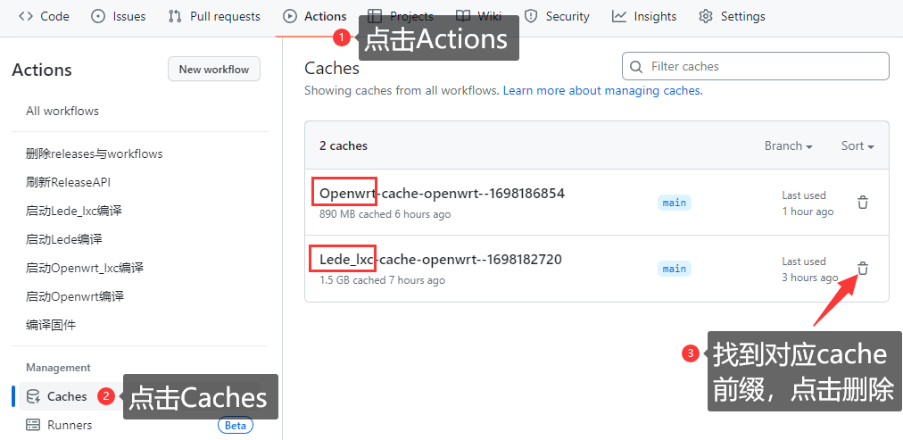

## 缓存加速

开启缓存加速，有助于缩减在线编译总时长。

在未开启缓存加速的情况下，编译时长在4~5小时时间，在开启后，相应时间可以缩短至2小时。


<br />


### 一、开启缓存加速


#### 1、settings.ini文件设置

在`build`目录的子文件夹内，把`settings.ini`中的设置如下：

```ini
ENABLE_CCACHE="true"
```


<br />


### 二、编译失败问题解决

如遇OpenWrt源码更新后，在线编译失败，确定不是源码bug问题；

可尝试清除对应的缓存文件，重新编译。


#### 1、清除对应的缓存文件

按照如下操作：

点击存储库`Actions` -> `Caches` -> 选择需要删除的缓存，点击右侧`垃圾桶`图标，即可删除相应缓存。

然后尝试全新编译。





#### 2、关闭缓存加速

如果依旧无法编译通过，也可以尝试关闭缓存加速，再次尝试。

在`build`目录的子文件夹内，把`settings.ini`中的设置如下

```ini
ENABLE_CCACHE="false"
```

<br />

**温馨提示：**

- 首次编译，因没有保存的缓存，无法加速；
- 再次编译，有保存的缓存，可以加速；
- 如果首次编译超时，可以选用较少的插件先完成编译；再次编译，再添加插件；
- 缓存建立的时间已经很久，因代码更新，可能使加速效果不明显，可清空缓存重新编译；
